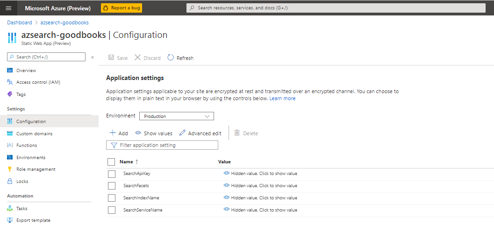

# Customizing this template

After deploying this sample, I'd encourage you to try it out with your own search index.

Up until now, you've been working with an existing index, but creating and loading an index with your own data is straightforward. You can create an index in the [Azure portal](https://docs.microsoft.com/azure/search/search-import-data-portal), use the [REST APIs](https://docs.microsoft.com/rest/api/searchservice/create-index), or use any of the Azure SDKs such as the new [Azure SDK for Javascript/TypeScript](https://github.com/Azure/azure-sdk-for-js/tree/master/sdk/search/search-documents/) that we used in this sample. Please see the Azure Cognitive Search [documentation](https://docs.microsoft.com/azure/search/search-get-started-portal) for more information on how to get started.

There are three main changes you'd need to make to use your own index:

## 1. Edit application settings in the portal

Navigate to the Azure portal -> find your Azure Static Web App -> select configuration -> edit the application settings.



## 2. Update Result and Detail components

Much of the UI won't require customization, however, if you integrate a new index with this template, you'll likely need to update the `Results` component and the `Details` component to reflect the fields in your index.

### Results

To edit the results view, first navigate to `src/components/Results/Result/Result.js`. This file represents a single result on the UI. In contrast, `src/components/Results/Results.js` controls the entire results view.

The JSX for the basic result looks like this:

```javascript
  <div className="card custom-result card-product-grid">
      <Link to={`/details/${props.document.productID}`}>
          </img>
          <div className="card-body text-center justify-content-center">
              <h6>{props.document.productName}</h6>
          </div>
      </Link>
  </div>
```

The property `props.document` will contain all of the fields returned by your query. The properties `productID`, `image_url`, and `productName` all correspond to fields in the fabrikam fashion index and should be updated to reflect the fields in your own search index.

Beyond that, you can customize this component as much as you want depending on the needs of your application.

### Details

The other component that needs to be customized is the Details view. This file can be found at `src/pages/Details/details.js`.

The component is currently designed as a card with multiple tabs to make it easy to present additional information on the screen.

To edit the main view, simply edit the JSX used to define the body variable. All fields within your search index will be a part of the `document` variable. These should be edited to match the properties in your index.

```javascript
  detailsBody = (
    <div className="card-body">
      <h5 className="card-title">{document.productName}</h5>
      <a href={document.productURL}>
        </img>
      </a>
      <p className="card-text">{document.description}</p>
    </div>
  );
```

The raw data tab simply prints out the entire `document` variable and doesn't need to be edited unless you'd like to change it.

You can also add additional tabs to show more content to your users.

```javascript
<li class="nav-item">
    <button class="nav-link active" onClick={() => setTab(2)}>New Tab</button>
</li>
```

## 3. Update Search function

[Semantic search](https://docs.microsoft.com/azure/search/semantic-search-overview) works best when specifying the searchFields in the request body so you'll also want to update the searchOptions in `api/search/search.js`.

Follow [this guidance](https://docs.microsoft.com/azure/search/semantic-how-to-query-request#step-2-set-searchfields) when selecting `searchFields`.

```javascript
searchOptions = {
    top: top,
    skip: skip,
    includeTotalCount: true,
    facets: Object.keys(facets),
    filter: createFilterExpression(filters, facets),
    queryType: "semantic",
    speller: "lexicon",
    queryLanguage: searchQueryLanguage || "en-us",
    answers: "extractive|count-3",
    searchFields: ["productName", "description"]
};
```